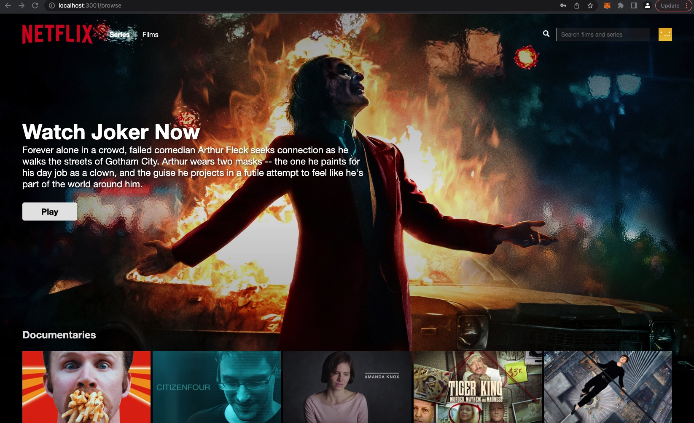

<div id="top"></div>


<!-- PROJECT LOGO -->
<br />
<div align="center">
    
</div>

<br />
<br />

<!-- TABLE OF CONTENTS -->
<details>
  <summary>Table of Contents</summary>
  <ol>
    <li>
      <a href="#about-the-project">About The Project</a>
      <ul>
        <li><a href="#built-with">Built With</a></li>
      </ul>
    </li>
    <li>
      <a href="#getting-started">Getting Started</a>
      <ul>
        <li><a href="#prerequisites">Prerequisites</a></li>
        <li><a href="#installation">Installation</a></li>
      </ul>
    </li>
    <li><a href="#usage">Usage</a></li>
    <li><a href="#contact">Contact</a></li>
  </ol>
</details>


<!-- ABOUT THE PROJECT -->
## About The Project

<div align="center">
    
</div>
<br />
<br />


This application called the (Netflix clone) was built using React (Custom Hooks, Context), Firebase & Styled Components. In this build is a fully funcational application where it allows the user to view the homepage, sign in, sign up, and browse. Most pages created are using protected routes with auth listeners. The authentication is handle by Firebase and all data is stored through firestore and retrieved using a custom hook.

I also used compound components to build my components, with made it really easy to test. The styling is all handled via styled components. 

<p align="right">(<a href="#top">back to top</a>)</p>


### Built With


* [React.js](https://reactjs.org/)
* [Firebase](https://firebase.google.com/)
* [styled-components](https://www.styled-components.com)


<p align="right">(<a href="#top">back to top</a>)</p>


<!-- GETTING STARTED -->
## Getting Started

To get a local copy up and running follow these instructions.

### Prerequisites

This is an example of how to list things you need to use the software and how to install them.
* npm
  ```sh
  npm install
  ```

### Installation

_Below is instruction your audience on installing and setting up your app.


1. Clone the repo
   ```sh
   git clone https://github.com/Nate-farley/netflix-clone.git
   ```
2. Install NPM packages
   ```sh
   npm install
   ```
3. Create a firebase account here 
   ```sh
   https://firebase.google.com/
   ```

4. Enter your API in `.env`
   ```js
    REACT_APP_API_KEY = "API Key"
    REACT_APP_AUTH_DOMAIN = "AUTH DOMAIN"
    REACT_APP_PROJECT_ID = "PROJECT ID"
    REACT_APP_STORAGE_BUCKET = "STORAGE BUCKET"
    REACT_APP_MESSAGING_SENDER_ID = "MESSAGING SENDER ID"
    REACT_APP_APP_ID= "APP ID"
   ```

<p align="right">(<a href="#top">back to top</a>)</p>


<!-- USAGE EXAMPLES -->
## Usage

The usage of Firesebase Auth and Firestore shows now easy it can be to integrated into an application and make request to and from the firebase. 

<p align="right">(<a href="#top">back to top</a>)</p>


<!-- CONTACT -->
## Contact

Your Name - [Nathan Farley]

Project Link:[https://github.com/Nate-farley/netflix-clone.git](https://github.com/Nate-farley/netflix-clone.git)

<p align="right">(<a href="#top">back to top</a>)</p>


